# 🎫 Help Desk Ticketing Lab

A hands-on IT/cybersecurity lab simulating a real enterprise help desk environment — built to develop practical skills in Active Directory, ticketing systems, help desk operations, and networking.

## 📋 Overview

This project documents the full build-out of a virtualized corporate IT environment using VirtualBox. The lab simulates a small organization called **TechOps** with a Windows Server domain controller, Windows 10 workstation, Ubuntu server, and a ticketing system — all networked together on an internal LAN.

## 🖥️ Lab Environment

| Virtual Machine | OS | Role | IP Address |
|---|---|---|---|
| HD-WS01 | Windows Server 2022 | Domain Controller / AD DS / DNS | 10.1.10.10 |
| WIN10-CLIENT | Windows 10 | Workstation / Help Desk Client | 10.1.10.3 |
| Ubuntu-Server | Ubuntu Server 24.04 | osTicket Help Desk Server | 10.1.10.20 |

**Network:** VirtualBox Internal Network (`homelab-net`) + NAT for internet access  
**Domain:** `techops.local`

## ✅ Phases Completed

### Phase 1–4 — Infrastructure Setup
- Installed and configured VirtualBox
- Deployed Windows Server 2022, Windows 10, and Ubuntu Server VMs
- Promoted Windows Server to Domain Controller
- Configured DNS and joined Windows 10 to `techops.local` domain
- Set up dual-adapter networking (NAT + Internal Network) across all VMs

### Phase 5 — Active Directory

Configured a full Active Directory environment with OUs, users, security groups, and password policies.

**Organizational Units & Users (25 total)**

| OU | Users |
|---|---|
| HR | Maria Delgado, Trevor Banks, Priya Nair, Curtis Owens, Fatima Hassan |
| IT | Derek Nguyen, Alicia Romero, Marcus Webb, Yuna Park, Blake Foster |
| Management | Sandra Howell, Raymond Cho, Ingrid Larsen, Patrick Osei, Diane Mercer |
| Helpdesk | Kyle Briggs, Aisha Patel, Jason Tully, Nora Kim, Victor Salinas |
| Interns | Emma Larson, Caleb Okafor, Sophie Tran, Darius Bell, Mia Hoffman |

**Security Groups:** Created one security group per OU with all department users as members.

**Password Policy (via GPO):**
- Minimum length: 8 characters
- Complexity: Enabled
- Max password age: 90 days
- Account lockout: 5 failed attempts / 30-minute lockout

**Screenshots:**

*Windows Server Manager — Domain Controller (techops.local)*
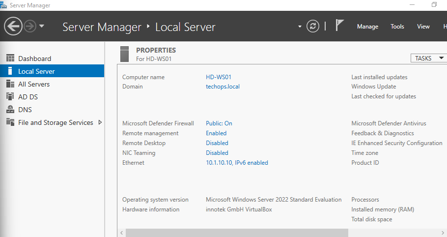

*Active Directory Users and Computers — OUs and Users*
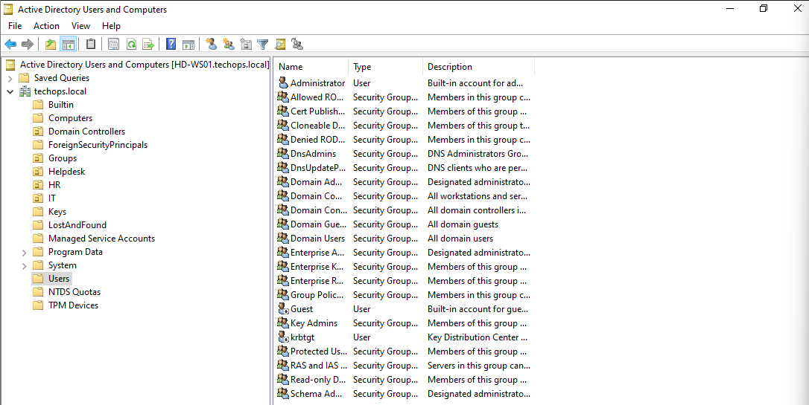

### Phase 6 — Help Desk (osTicket)

Deployed osTicket v1.18.3 on Ubuntu Server. Configured departments, agents, and simulated real help desk ticket workflows integrated with Active Directory.

**osTicket Setup:**
- Installed LAMP stack (Apache, MySQL, PHP) on Ubuntu Server
- Deployed osTicket at `http://10.1.10.20/osticket/scp`
- Created departments: IT Support, HR, Network & Infrastructure
- Created 5 help desk agents from the Helpdesk OU

**Agents Created:**

| Agent | Username | Department |
|---|---|---|
| Kyle Briggs | kbriggs | IT Support |
| Aisha Patel | apatel | IT Support |
| Jason Tully | jtully | IT Support |
| Nora Kim | nkim | HR |
| Victor Salinas | vsalinas | Network & Infrastructure |

**Tickets Simulated:**

| # | Issue | User | Priority | Resolution |
|---|---|---|---|---|
| 1 | Cannot log into computer | Maria Delgado | High | Password reset in Active Directory |
| 2 | Account locked out | Trevor Banks | Emergency | Account unlocked via ADUC |
| 3 | New employee setup | Sandra Howell | Normal | AD account created in Interns OU |
| 4 | Printer not working | Priya Nair | Normal | Print Spooler restarted, queue cleared |
| 5 | VPN access request | Blake Foster | Normal | VPN credentials provisioned |

**Screenshots:**

*osTicket Installation Complete*
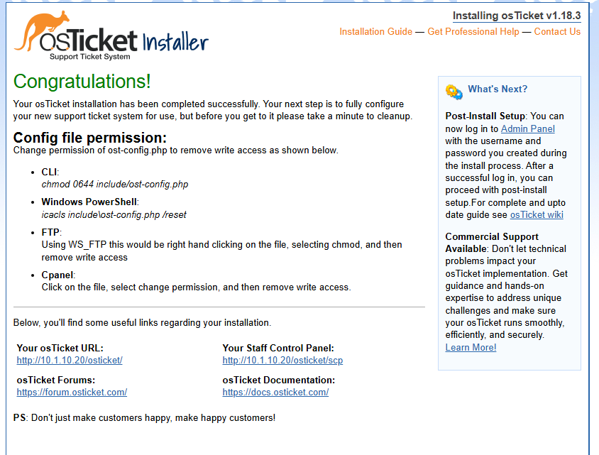

*osTicket Login Page — TechOps Help Desk*
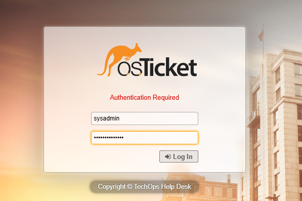

*Admin Panel — Department Access Configuration*
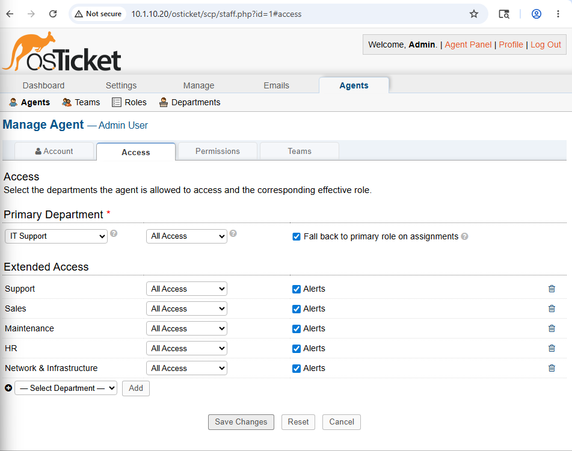

*Ticket #196448 — Password Reset (Maria Delgado)*
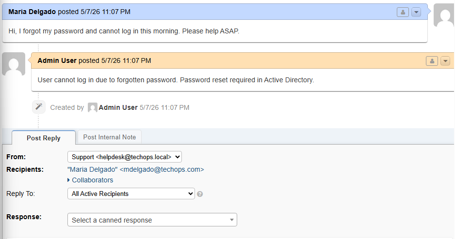

*Active Directory — Password Reset for mdelgado*
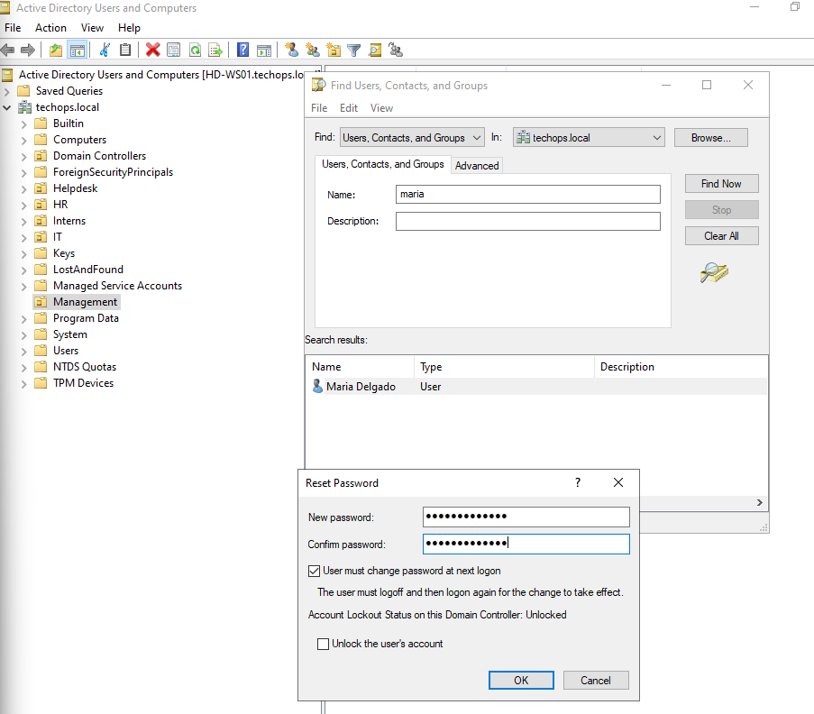

*Ticket #195467 — Account Lockout (Trevor Banks)*
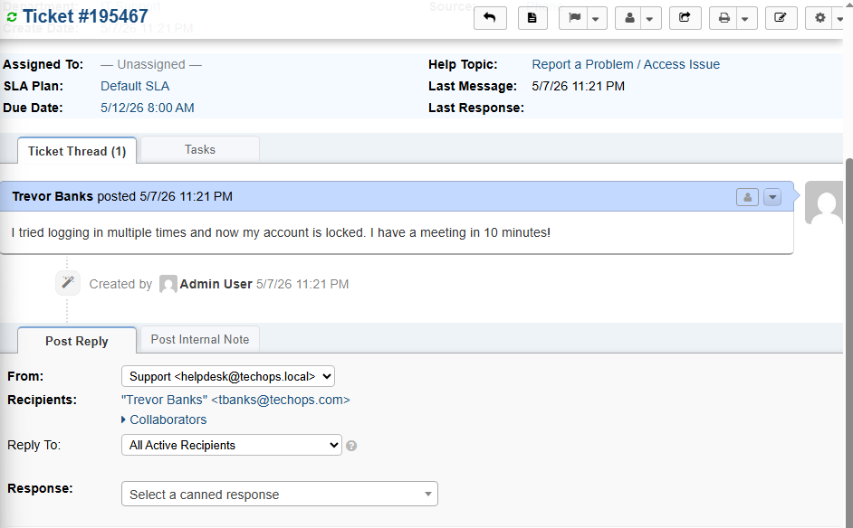

*Active Directory — Unlock Account for tbanks*
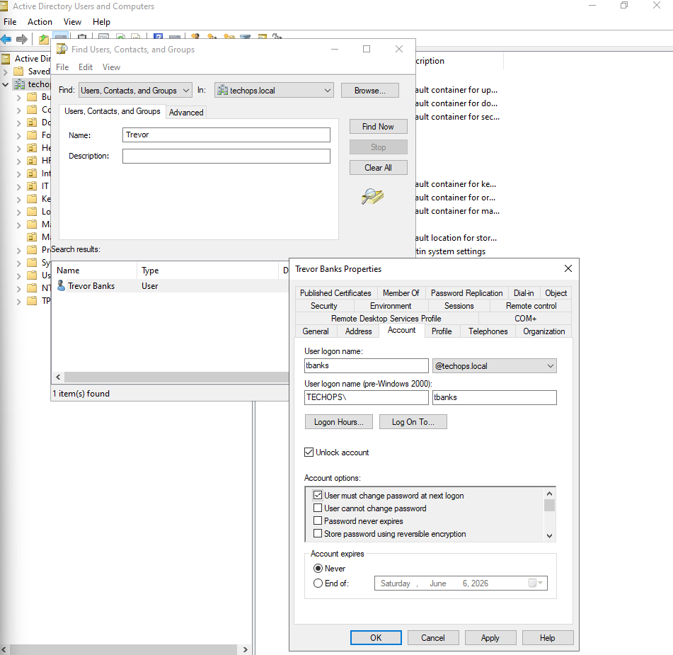

*Ticket #698705 — New Employee Setup (Sandra Howell)*
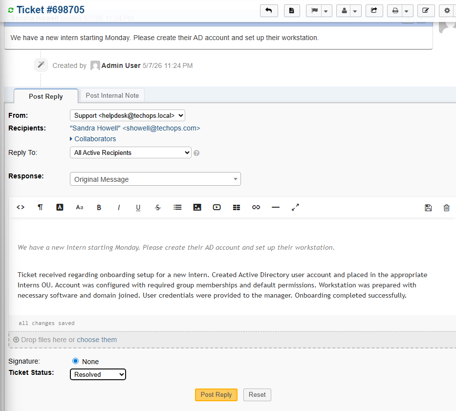

*Ticket #887616 — Printer Issue (Priya Nair)*
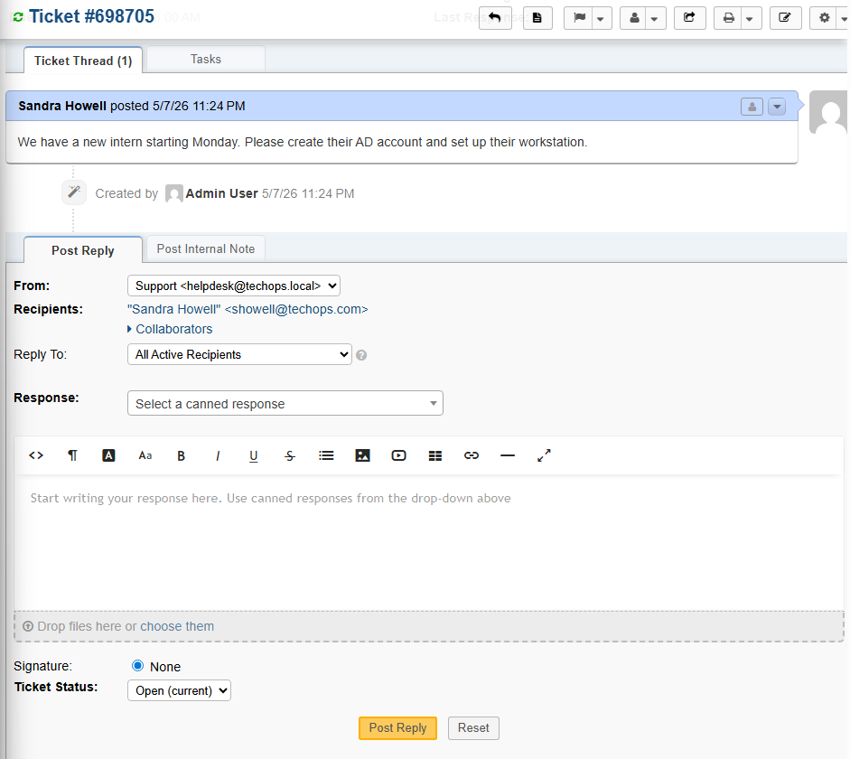

*Ticket #779249 — VPN Access Request (Blake Foster)*
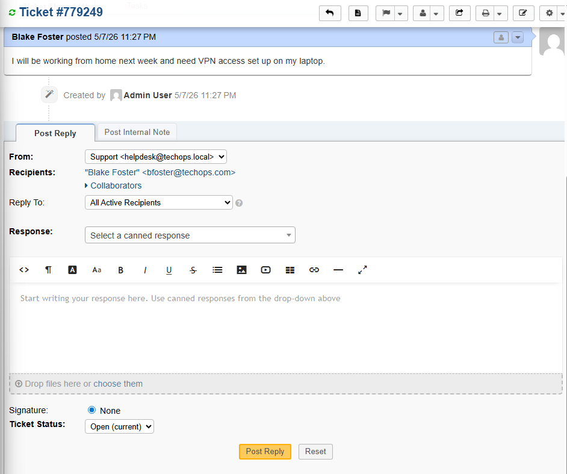

*Departments Overview*
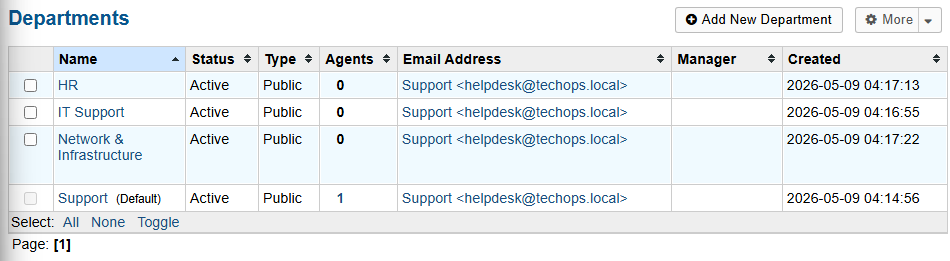

## 🔧 Tools & Technologies

- **Virtualization:** VirtualBox
- **Operating Systems:** Windows Server 2022, Windows 10, Ubuntu Server 24.04
- **Directory Services:** Active Directory Domain Services (AD DS), DNS
- **Help Desk:** osTicket v1.18.3
- **Web Stack:** Apache2, MySQL, PHP
- **Scripting:** PowerShell (AD automation)
- **Networking:** VirtualBox NAT + Internal Network, static IP assignment, netplan

⚙️ Configuration Files
configs/install-osticket.sh
Full bash installation script for deploying osTicket on Ubuntu Server 24.04. Covers system update, LAMP stack installation, database creation, file deployment, and permission setup.
configs/00-installer-config.yaml
Netplan network configuration for Ubuntu Server. Configures two network adapters:

enp0s3 — NAT adapter with DHCP for internet access
enp0s8 — Static IP 10.1.10.20/24 on the internal lab network for VM-to-VM communication

